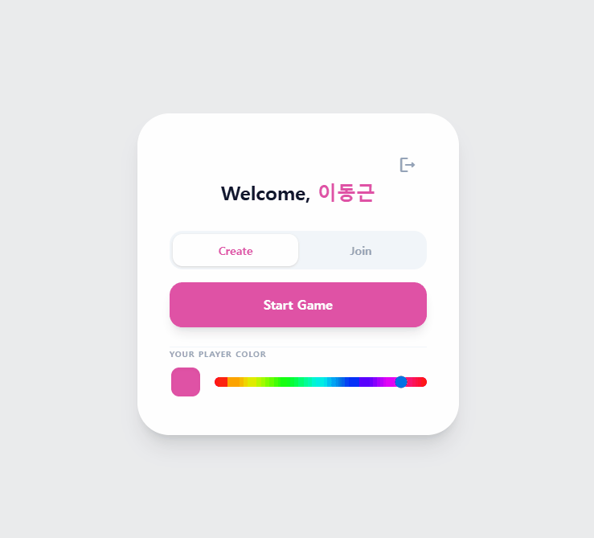
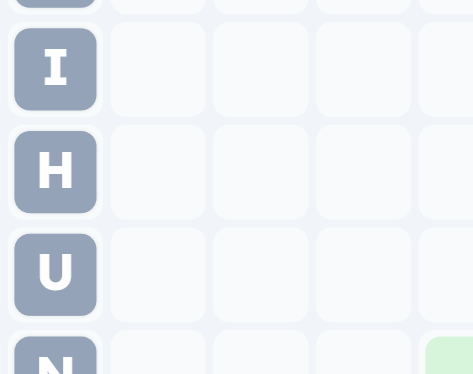
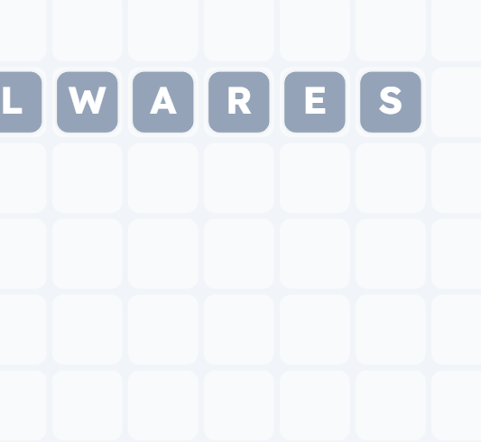
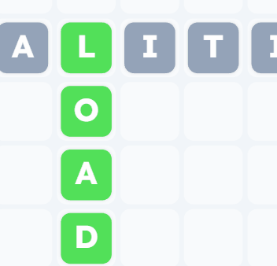
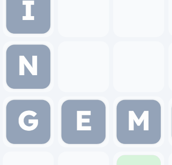
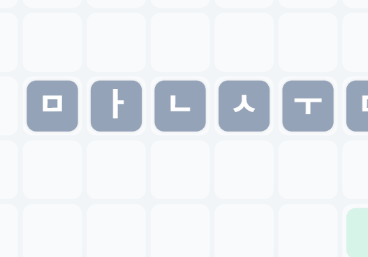
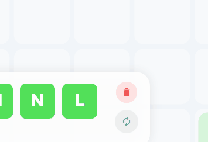

# Yeet! (Scribble Online - Korean Version)

Yeet!은 한글 자모를 조합하여 단어를 만들고 점수를 획득하는 실시간 멀티플레이어 워드 게임입니다. 
빠른 판단력과 전략적인 단어 배치를 통해 다른 플레이어들과 경쟁해보세요!

## 🚀 기술 스택

- **Backend**: Python (FastAPI), PostgreSQL, SQLAlchemy, WebSockets
- **Frontend**: Vanilla JavaScript, Tailwind CSS, HTML5 Canvas
- **DevOps**: Docker, Docker Compose

---

## 🎮 게임 튜토리얼 (Tutorial)

### 1. 로그인 (Login)
게스트 로그인 또는 구글 계정을 통해 간편하게 접속할 수 있습니다.

| 게스트 로그인 | 구글 로그인 |
| :---: | :---: |
|  |  |

### 2. 방 생성 및 게임 시작 (Lobby & Game Start)
방을 생성하고 친구들을 기다리거나, 바로 게임을 시작할 수 있습니다.

| 방 생성 | 게임 시작 |
| :---: | :---: |
|  |  |

### 3. 기본적인 단어 배치 (Basic Word Placement)
한글 자모 타일을 드래그하여 가로 또는 세로로 단어를 완성하세요.

| 가로 단어 배치 | 세로 단어 배치 |
| :---: | :---: |
|  |  |

### 4. 교차 단어 (Cross Word)
이미 배치된 단어의 타일을 공유하여 새로운 단어를 교차해서 만들 수 있습니다.

| 교차 단어 만들기 1 | 교차 단어 만들기 2 |
| :---: | :---: |
|  |  |

### 5. 한글 조합 (Korean Jamo Combination)
초성, 중성, 종성을 조합하여 완벽한 한국어 단어를 구성해보세요.



### 6. 플레이어 액션 (Actions)
상황에 따라 타일을 교체하거나 삭제할 수 있습니다.

| 타일 리롤 (Reroll) | 타일 삭제 (Trashcan) |
| :---: | :---: |
|  |  |

---

## 🛠️ 설치 및 실행 (Setup)

Docker를 사용하여 로컬 환경에서 간편하게 실행할 수 있습니다.

1. `.env` 파일 설정:
   ```env
   DATABASE_USER=your_user
   DATABASE_PASSWORD=your_password
   DATABASE_NAME=yeet_db
   SERVER_PORT=8000
   ```

2. Docker 실행:
   ```bash
   docker-compose up --build
   ```

3. 접속:
   웹 브라우저에서 `http://localhost:8000`으로 접속합니다.
